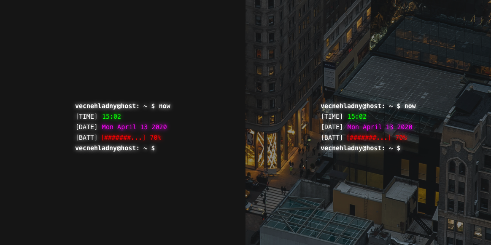

# BASH TERMINAL widget
A simple bash terminal styled widget for Übersicht. The reason of its creation was that i saw something similar on Reddit and i decided to recreate it. And also fun little project in JavaScript/CoffeScript.



## Features
**Clock**

**Date**

**Username**

**Battery status**

 
## Instalation
1. Download and install Übersicht from their [website](http://tracesof.net/uebersicht/)
2. Clone this repository or download a [zip file](terminal.widget.zip)
```
git clone https://github.com/vecnehladny/ubersicht-termina-widget ~/Library/Application\ Support/Übersicht/widgets/ubersicht-termina-widget/
```

## Requirements
1. Übersicht of course

## Customization
You can set brightness of the neon effect
```
brightness = 10
```

## Enjoy!
Fork it, learn with it, do whatever with it. Just remember to have fun!

